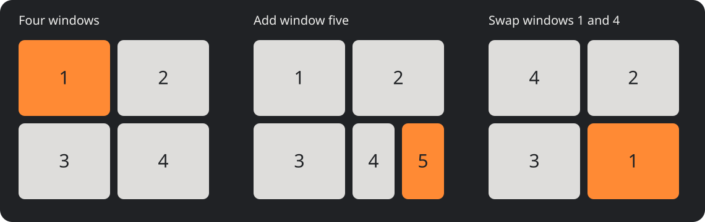

<p align="center">
  
</p>

# McTiler

A macOS tiling window manager inspired by i3, awesome, and AeroSpace. Arrange windows in quadrants, switch numbered workspaces with Option shortcuts, and move between tiling and floating from a small menu-bar app.

- **Automatic tiling:** four quadrants, then subdivide the bottom-right tile.
- **Focus follows mouse:** move into a window and type without clicking.
- **Drag to rearrange:** drag a title bar onto another tile to swap positions.
- **Fullscreen in place:** fill the display below the menu bar without creating a native macOS Space.
- **Workspaces 1–9:** the menu-bar icon shows the active number.
- **Configurable:** split layouts, floating windows, application rules, and 12-point inner gaps.

[Install](#install-from-source) · [Controls](#everyday-controls) · [Configuration](#configuration) · [Usage guide](docs/usage.md) · [Report an issue](https://github.com/tjukkefeiten/mctiler/issues)

McTiler is in early development. Single-display tiling, fullscreen focus, pointer focus, and tile dragging have been tested interactively. Cross-display behavior has automated coverage but still needs broader live validation. See [test evidence and limitations](docs/validation.md).

## Install from source

There are **no published binary releases or package-manager installers yet**. Build locally using the steps below; the resulting app is ad-hoc signed, not notarized.

Requirements:

- macOS **26 or later**. Development and live testing currently use Apple Silicon.
- Apple Command Line Tools with Swift; the tested toolchain is **Swift 6.3**. Full Xcode is not required.
- Accessibility permission for McTiler. SIP can remain enabled.

Install Command Line Tools if needed:

```sh
xcode-select --install
```

After installation finishes, verify the toolchain, clone, test, and build:

```sh
swift --version
git clone https://github.com/tjukkefeiten/mctiler.git
cd mctiler
bash scripts/test.sh
bash scripts/build-app.sh
open dist/McTiler.app --args --paused
```

The build produces `dist/McTiler.app` and `dist/mctiler` (the command-line tool). All CLI examples below run from the repository directory. Keep the app in a stable location. You may move it to Applications before granting permission; do not run two copies.

### First launch

1. Pause any other tiling manager.
2. Click the McTiler icon and workspace number in the menu bar.
3. Choose **Grant Accessibility Access…**.
4. Enable McTiler under **System Settings → Privacy & Security → Accessibility**.
5. Choose **Resume** from the McTiler menu.

The menu-bar pause symbol **‖** disappears when management resumes. Check with:

```sh
./dist/mctiler status
```

Use one native macOS desktop per display for this version; McTiler manages its own workspaces. To launch at login, optionally add the app in macOS Login Items. McTiler does not configure this automatically.

## How it works



*Layout illustration, not a desktop screenshot. Numbers represent window insertion order.*

One window fills the usable area. Two share columns. Window three splits the left column; window four splits the right. Window five splits only bottom-right. Later windows split the newest tile with alternating orientations. Floating windows do not occupy tiled positions.

Drag a window by its title bar and release the pointer inside another tile's original position to swap them. Focus follows the moved window. Drops in gaps or outside eligible tiles restore the layout; Escape cancels the swap. Floating windows move normally. Explicit splits, resizing, movement, or a tile swap put the workspace into manual layout so your changes persist for the session.

Move the mouse into a visible window to focus it. A stationary pointer does not undo keyboard focus, and dragging suppresses pointer focus. **Option + Shift + Escape** toggles fullscreen and keyboard focus; press again to restore the previous layout. Fullscreen reserves the top menu bar and stays in the same workspace. Menu-bar auto-hide still follows your macOS setting.

[Read the detailed guide](docs/usage.md) for nested splits, display/workspace behavior, and floating-window stacking.

## Everyday controls

Option is spelled `alt` in configuration. Keys refer to physical US keyboard positions; bindings can be changed for your keyboard layout.

| Shortcut | Action |
| --- | --- |
| Option + arrows | Focus a window in that direction |
| Option + Shift + arrows | Move a tile/container or floating window |
| Option + Control + arrows | Resize; right/down grow, left/up shrink |
| Option + 1–9 | Switch workspace |
| Option + Shift + 1–9 | Send the focused window to a workspace |
| Option + Shift + Escape | Toggle fullscreen, raise, and focus |
| Option + Control + F | Same fullscreen toggle |
| Option + Control + Space | Toggle floating for the whole workspace |
| Option + Control + H / V | Create a horizontal / vertical split |
| Option + Control + P / C | Select parent / first child container |
| Option + Control + R | Reload configuration |
| Option + Control + Escape | Pause and restore windows |

Individual floating has no default shortcut. Toggle it with the CLI or assign a custom binding:

```sh
./dist/mctiler floating
./dist/mctiler workspace 2
./dist/mctiler pause
./dist/mctiler resume
```

Resume from the menu or CLI: pausing releases all shortcuts.

## Configuration

Configuration is optional. Without a file, defaults include **12-point inner gaps**, **8-point outer gaps**, pointer focus, and the shortcuts above. Geometry uses macOS logical points, including on Retina displays.

Create `~/.config/mctiler/config.toml` in your editor. A minimal file can contain:

```toml
inner-gap = 12
outer-gap = 8
focus-follows-mouse = true
```

Set `focus-follows-mouse = false` to disable pointer focus. Explicit settings survive upgrades; new defaults do not overwrite your file.

For a full starting point, copy [config.example.toml](config.example.toml) only if you do not already have a config:

```sh
mkdir -p ~/.config/mctiler
cp -n config.example.toml ~/.config/mctiler/config.toml
./dist/mctiler check-config
./dist/mctiler reload
```

A `[bindings]` table **replaces all default shortcuts**. To add a floating shortcut while retaining other controls, start from the full example and add this inside its `[bindings]` table:

```toml
alt-space = "floating"
```

Application rules go after other tables and match exact bundle identifiers. For example, float newly discovered System Settings windows:

```toml
[[rules]]
bundle = "com.apple.systempreferences"
floating = true
```

First matching rule wins; rules apply to newly discovered windows. Reload does not reclassify existing windows. Strings require double quotes; unsupported TOML syntax and unknown keys are rejected. An invalid reload preserves the working config. See the example for monitor assignments and all bindings.

Older configs using `cmd` retain their custom shortcuts. Edit the keys to use `alt`, and set `alt-shift-escape = "fullscreen"` for the current fullscreen behavior, then validate and reload.

## Troubleshooting

| Symptom | What to do |
| --- | --- |
| No windows move | Check `./dist/mctiler status`, grant Accessibility, and choose Resume. |
| Permission stopped working after a rebuild | Follow the reset steps below; a checked toggle can refer to the old signature. |
| A shortcut does not work | Pause McTiler and other managers, then run `./dist/mctiler check-hotkeys`. Adjust conflicting bindings and Resume. |
| Windows overlap or refuse to shrink | Apps can enforce minimum sizes. Move some windows to another workspace or float them. Small subdivided tiles may not fit every app. |
| Layout pauses after switching displays | Check status for parking or recovery failures; see [recovery](docs/recovery.md). |
| The icon in Settings is outdated | Quit and reopen System Settings after updating the app. |

### Renew Accessibility after rebuilding

Local builds change the app signature. If permission no longer works, quit McTiler through its menu, then reset only its Accessibility entry:

```sh
tccutil reset Accessibility local.mctiler.app
open dist/McTiler.app --args --paused
```

Click the menu-bar icon → **Grant Accessibility Access…**, enable the new entry in Settings, and choose **Resume**. If you moved the app to Applications, open that copy instead. Avoid rebuilding between granting permission and testing.

### Current limitations

- Complete Dock suppression is unavailable. The experimental option reports this and does not change Dock preferences. The Dock can appear over McTiler fullscreen. See [Dock feasibility](docs/dock-feasibility.md).
- Virtual workspaces park inactive windows near a screen edge; a narrow strip can remain visible. Some display arrangements or apps reject parking.
- App minimum sizes and Accessibility support affect placement, focus, and stacking.
- Cross-display swaps and recovery need broader hardware testing. There is no drag-target highlight yet.
- Layout trees and workspace assignments for individual windows are not saved across app restarts. Configuration and the recovery journal are saved.

## Recovery and uninstall

**Pause and Restore Windows** or **Quit McTiler** restores managed windows. If recovery reports unresolved entries, keep the affected apps open and retry **Recover Windows** before deleting anything.

After a crash, relaunch McTiler to recover. Alternatively, with the app stopped:

```sh
./dist/mctiler recover --standalone
```

Standalone recovery needs Accessibility permission for the CLI or its launching terminal. [Recovery details](docs/recovery.md) explain journal matching and unresolved entries.

To uninstall:

1. Quit McTiler and confirm your windows are restored.
2. Remove it from Login Items if you added it, and remove its Accessibility permission.
3. Delete `McTiler.app` and the `mctiler` CLI, or the source checkout if you no longer need it.
4. Optionally remove `~/.config/mctiler` and `~/Library/Application Support/McTiler` after recovery is complete. The latter contains a recovery journal with window titles and geometry.

## Development

Written in Swift with AppKit and Accessibility APIs. See [development](docs/development.md) for target structure, build/test commands, and runtime design, and [validation](docs/validation.md) for test history.

Report reproducible problems in [GitHub Issues](https://github.com/tjukkefeiten/mctiler/issues), including macOS version, affected app, steps, and relevant status output. Review any window titles before sharing recovery data.
